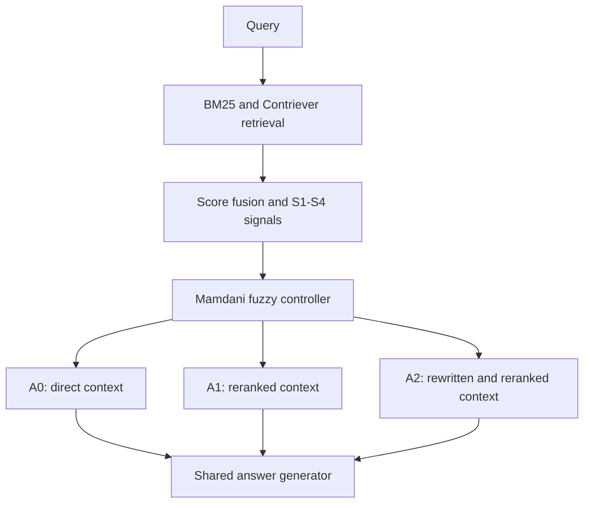

# FuzzyRoute-RAG

Uncertainty-aware adaptive routing for retrieval-augmented generation using an interpretable fuzzy controller.

> **Project status:** Active research prototype. The retrieval, uncertainty-signal, fuzzy-controller, threshold-selection, width-calibration, data-split, and evaluation-metric components are implemented and unit-tested. The paraphrase clusters and the complete A0/A1/A2 generation pipeline are still under development. No final paper results are reported in this repository yet.

## Overview

Retrieval-augmented generation (RAG) systems often apply the same retrieval and generation procedure to every query. This can waste computation on easy queries while failing to allocate sufficient processing to difficult or unstable queries.

FuzzyRoute-RAG investigates whether four retrieval-side uncertainty signals can be combined by a transparent Type-1 Mamdani fuzzy inference system to select among retrieval actions with different computational costs. The intended objective is to improve the answer-quality–cost trade-off while reducing unnecessary routing changes across semantically equivalent query formulations.

The controller uses deterministic, human-readable rules instead of treating routing as an opaque decision.

## Research Question

Can an interpretable fuzzy controller use retrieval uncertainty to select the least costly action that maintains answer quality and remains stable across paraphrased queries?

## Method Overview



The current repository implements retrieval, fusion, S1–S4, fuzzy inference, cost-constrained threshold selection, the A2 merge rule, jitter-width calibration, the cluster-level data split, and the evaluation metrics. The three complete action pipelines and shared answer generator shown above are part of the planned experimental pipeline.

## Retrieval and Fusion

The initial candidate pool is produced by two complementary retrievers:

- **Sparse retrieval:** BM25 over the DPR Wikipedia passage corpus through Lucene/Pyserini.
- **Dense retrieval:** `facebook/contriever-msmarco`, using mean-pooled, unnormalized embeddings and inner-product scoring.

Each retriever returns its top 50 passages. Scores are normalized independently within each query and combined using equal-weight score fusion. Documents missing from one retrieval list receive zero from that retriever.

## Routing Signals

All raw signals are oriented so that a larger value indicates greater uncertainty and a stronger need to escalate.

### S1: Margin uncertainty

Let \(s_1 \geq s_2 \geq \cdots \geq s_k\) denote fused retrieval scores:

$$
S_1 = 1 - \frac{s_1-s_2}{s_1-s_k+\epsilon}.
$$

### S2: Rank disagreement

Rank disagreement is derived from extrapolated Rank-Biased Overlap between the BM25 and dense top-\(k\) rankings:

$$
\operatorname{RBO}_{\mathrm{EXT}}@k
=
(1-p)\sum_{d=1}^{k}p^{d-1}A_d+p^kA_k,
$$

$$
S_2 = 1-\operatorname{RBO}_{\mathrm{EXT}}@k,
$$

where \(A_d\) is the overlap proportion at depth \(d\). The current default is \(p=0.9\) and \(k=10\).

### S3: Evidence dispersion

For the embeddings of the top-\(k\) fused passages:

$$
S_3 = 1-\frac{2}{k(k-1)}\sum_{i<j}\cos(\mathbf{e}_i,\mathbf{e}_j).
$$

### S4: Score entropy

The top-\(k\) fused scores are converted to a probability distribution using a temperature-scaled softmax. The normalized entropy is:

$$
S_4 = -\frac{\sum_{i=1}^{k}p_i\log p_i}{\log k}.
$$

The current temperature is \(\tau=0.1\).

Before fuzzy inference, each signal is rescaled using the 5th and 95th percentiles fitted on training clusters only. Validation and test clusters must not be used to fit these scalers.

## Fuzzy Controller

The controller is a Type-1 Mamdani fuzzy inference system with:

- Four inputs: S1, S2, S3, and S4.
- Three linguistic labels per input: Low, Medium, and High.
- A complete \(3^4=81\)-rule base.
- Minimum for fuzzy AND.
- Maximum for rule aggregation.
- Centroid defuzzification.
- A continuous escalation score followed by two validation-selected thresholds.

Rules are generated from the ordinal levels Low = 0, Medium = 1, and High = 2. If the four-level sum is \(t\), the consequent is:

- Low escalation when \(t\leq3\).
- Medium escalation when \(t=4\).
- High escalation when \(t\geq5\).

This produces 31 Low, 19 Medium, and 31 High consequent rules.

The default membership-function width is 0.20. Per-signal calibrated widths are supported, with a maximum allowed width of 0.25.

## Routing Actions

| Action | Intended operation | Current status |
|---|---|---|
| A0 | Use the fused top-5 passages directly | Pipeline pending |
| A1 | Rerank the fused top-20 and retain the top 5 | Pipeline pending |
| A2 | Rewrite the query, perform a second hybrid retrieval, merge and deduplicate candidates, rerank the top 30, and retain the top 5 | Pipeline pending |

All actions are intended to use the same final top-5 context size, answer generator, prompt, and decoding configuration. This isolates the effect of routing and retrieval processing.

## Current Implementation Status

- [x] DPR passage reader
- [x] DPR-style answer matching and Recall@k
- [x] BM25 retrieval wrapper
- [x] Contriever query encoding
- [x] Exact sharded dense retrieval
- [x] Equal-weight hybrid fusion
- [x] S1–S4 computation
- [x] Training-only percentile scaler primitives
- [x] 81-rule Mamdani fuzzy controller
- [x] Operator ablations: product t-norm, probabilistic sum, Sugeno-0
- [x] Output-monotonicity report (reproduces the specification's grid measurements)
- [x] Validation-time threshold search under a cost budget
- [x] Fixed-action policy evaluation primitives
- [x] A2 candidate merge and rewrite-fallback rule
- [x] Cluster-level train/validation/test split
- [x] Jitter-width calibration (per-signal widths, with clipping flagged)
- [x] Oracle action, routing flip rate (RFR), harmful flip rate (HRFR), and within-cluster robustness measures
- [x] Cluster-bootstrap confidence intervals and paired comparisons
- [x] Hard-threshold (B1), crisp ordinal (B2), fixed-width (B3), and calibrated-fuzzy (B4) baselines
- [x] `config.yaml` with every fixed parameter, checked against the code by tests
- [x] Pinned environment files
- [x] Unit tests for implemented components
- [ ] Config-driven data and experiment pipeline
- [ ] Paraphrase generation and cluster validation
- [ ] A0, A1, and A2 end-to-end actions
- [ ] Shared answer-generation pipeline
- [ ] EM and token-level F1 on generated answers
- [ ] Final paper tables

## Repository Structure

```text
Fuzzy-RAG/
├── main_logic/
│   ├── actions.py       # A2 candidate merge and rewrite fallback
│   ├── answers.py       # DPR-style answer matching and Recall@k
│   ├── bm25.py          # BM25 retrieval wrapper
│   ├── baselines.py     # Controller baselines B1-B4 and their threshold fitting
│   ├── calibration.py   # Jitter-width calibration of the membership functions
│   ├── config.py        # Loads config.yaml
│   ├── corpus.py        # DPR passage reader
│   ├── dense.py         # Contriever encoder and dense retrieval
│   ├── evaluation.py    # Oracle action, RFR/HRFR, robustness, bootstrap CIs
│   ├── fuzzy.py         # Mamdani fuzzy controller, rule base, and operator ablations
│   ├── monotonicity.py  # Grid measurement of output-monotonicity violations
│   ├── routing.py       # Action assignment and threshold selection
│   ├── signals.py       # Fusion, S1-S4, and signal scaling
│   └── splits.py        # Cluster-level train/validation/test split
├── scripts/
│   ├── bm25_search.py
│   ├── datasets.py           # Corpus and index paths per dataset
│   ├── export_corpus.py      # Lucene stored passages -> DPR-layout TSV
│   ├── monotonicity_report.py
│   ├── smoke_retrieval.py
│   └── verify_embeddings.py
├── tests/
├── config.yaml              # Every fixed experiment parameter; fitted values added later
├── requirements.txt         # Main environment, exact versions
├── requirements-bm25.txt    # BM25 environment, exact versions
└── .gitignore
```

## Installation

The project uses separate environments for the main pipeline and Pyserini BM25 retrieval. Both are pinned to exact package versions.

### Core and dense-retrieval environment (Python 3.14)

```powershell
py -3.14 -m venv .venv
.venv\Scripts\python.exe -m pip install -r requirements.txt
```

`requirements.txt` installs PyTorch `2.14.1+cu126` from the PyTorch CUDA 12.6 index. Do not replace it with a plain `pip install torch`: on Windows that installs a CPU-only build, and newer CUDA builds no longer support Pascal GPUs such as the Quadro P2200 used here. Check that the GPU is usable:

```powershell
.venv\Scripts\python.exe -c "import torch; print(torch.cuda.is_available(), torch.cuda.get_arch_list())"
```

### BM25 environment (Python 3.13)

Pyserini does not support Python 3.14, and installing it into the main environment would replace the CUDA build of PyTorch, so it has its own environment:

```powershell
py -3.13 -m venv .venv-bm25
.venv-bm25\Scripts\python.exe -m pip install -r requirements-bm25.txt
```

Pyserini also needs a Java Development Kit and `JAVA_HOME`. It documents Java 21; Microsoft OpenJDK 25.0.4 was tested and works:

```powershell
setx JAVA_HOME "C:\Program Files\Microsoft\jdk-25.0.4.101-hotspot"
```

On Windows consoles that cannot print all Unicode characters, set `PYTHONUTF8=1` before running the scripts.

## External Data and Indexes

Large datasets and indexes are not included in the repository. The experiment uses these exact files:

| File | Source | Size | Check |
|---|---|---|---|
| DPR Wikipedia passages, `psgs_w100.tsv.gz` (21,015,324 passages) | `https://dl.fbaipublicfiles.com/dpr/wikipedia_split/psgs_w100.tsv.gz` | 4,694,541,059 bytes | SHA-256 `c39b020c855a2b5c25ffef3abe4a3b6f9b829ad7dbc14ec3d163d34d7c53ea8d` |
| Precomputed `facebook/contriever-msmarco` passage embeddings | `https://dl.fbaipublicfiles.com/contriever/embeddings/contriever-msmarco/wikipedia_embeddings.tar` | 32,499,691,520 bytes | No published checksum; verified with `scripts.verify_embeddings` |
| Prebuilt Lucene BM25 index over the same passages | `https://rgw.cs.uwaterloo.ca/pyserini/indexes/lucene/lucene-inverted.wikipedia-dpr-100w.20260508.deb4c7b.tar` | 11,078,635,520 bytes | MD5 `1ef94a97f2ac418577d1e6a9ecf44806` |
| HotpotQA questions (train, dev distractor, dev fullwiki) | Hugging Face `hotpotqa/hotpot_qa`, converted to the original JSON layout | 90,447 / 7,405 / 7,405 questions | — |
| Prebuilt Lucene BM25 index of the BEIR HotpotQA abstracts (5,233,329) | `https://huggingface.co/datasets/castorini/prebuilt-indexes-beir/resolve/main/lucene-inverted/flat/lucene-inverted.beir-v1.0.0-hotpotqa.flat.20221116.505594.tar.gz` | 2,019,088,696 bytes | MD5 `3f41d640a8ebbcad4f598140750c24f8` |
| Prebuilt `contriever-msmarco` FAISS flat index of the same abstracts | `https://rgw.cs.uwaterloo.ca/pyserini/indexes/faiss/faiss-flat.beir-v1.0.0-hotpotqa.contriever-msmarco.20230124.tar.gz` | 14,889,518,959 bytes | MD5 `38c37708f9927501ca2f7563aa43f407`; verified with `scripts.verify_embeddings --dataset hotpotqa` |
| NQ-open development questions (smoke tests only) | `https://raw.githubusercontent.com/google-research-datasets/natural-questions/master/nq_open/NQ-open.dev.jsonl` | 3,610 questions | SHA-256 `f15567f38099f3615f5b8a685c0aef449c11ad90d3da3735e8d1b98115b40616` |

Unpack the two archives:

```bash
mkdir -p bm25 contriever-msmarco
tar -xf lucene-inverted.wikipedia-dpr-100w.20260508.deb4c7b.tar -C bm25
tar -xf wikipedia_embeddings.tar -C contriever-msmarco
mkdir -p hotpotqa
tar -xzf lucene-inverted.beir-v1.0.0-hotpotqa.flat.20221116.505594.tar.gz -C hotpotqa
tar -xzf faiss-flat.beir-v1.0.0-hotpotqa.contriever-msmarco.20230124.tar.gz -C hotpotqa
```

HotpotQA's abstract texts are stored only inside the BM25 index. Export them once, in the BM25 environment, to a TSV in the DPR layout that the main environment reads:

```bash
.venv-bm25/Scripts/python -m scripts.export_corpus \
  data/hotpotqa/lucene-inverted.beir-v1.0.0-hotpotqa.flat.20221116.505594 \
  data/hotpotqa/corpus.tsv.gz
```

The HotpotQA dense index is read directly from the FAISS file with numpy (a 45-byte header followed by the float32 vectors); the FAISS library is not needed.

The unsupervised `contriever` and the `contriever-msmarco` embedding archives have exactly the same size, so check that you downloaded the right one; `scripts.verify_embeddings` fails for the wrong checkpoint. The embedding shards are Python pickles, and loading a pickle can execute code, so load only the official release.

The dense embeddings and sparse index must use the same passage-ID space. For NQ the loader verifies consecutive dense passage IDs; for HotpotQA it reads the index's `docid` file (Wikipedia page IDs) and rejects duplicates. The smoke test checks retrieval behavior and answer recall.

### Path configuration

Data paths are recorded in `config.yaml` under `data:`. The scripts take their paths from `scripts/datasets.py`, and `tests/test_config.py` checks that it matches `config.yaml`, so if the data moves, update both.

## Running the Tests

From the repository root:

```bash
python -m pytest -q
```

The tests cover retrieval primitives, ranking signals, the complete fuzzy rule base, membership functions, deterministic action assignment, threshold selection, cost-aware policy evaluation, the A2 merge rule, width calibration, the data split, the evaluation metrics, and the agreement between `config.yaml` and the code. Tests that require large external indexes are handled through separate smoke scripts rather than the unit-test suite.

## Running Retrieval Checks

### 1. BM25 retrieval

The input is NQ-open's JSON Lines file or a HotpotQA `.json` file. Add `--dataset hotpotqa` for HotpotQA (default `nq`); the same option applies to the next two scripts.

```bash
python -m scripts.bm25_search \
  path/to/questions.jsonl \
  results/smoke/bm25.jsonl \
  --n 100 \
  --k 50
```

### 2. End-to-end retrieval smoke test

The question file must provide `question` and `answer` fields (NQ: a list of accepted answers; HotpotQA: one string). HotpotQA's yes/no answers cannot be found in a passage by string matching, so those questions are left out of Recall@k and counted.

```bash
python -m scripts.smoke_retrieval \
  results/smoke/bm25.jsonl \
  path/to/NQ-open.dev.jsonl \
  results/smoke
```

The script produces:

- `retrieval.jsonl`: BM25, dense, fused rankings, and S1–S4 for each query.
- `report.json`: Recall@k, signal summaries, correlations, and runtime measurements.

The smoke test is a technical check and must not be reported as the final experiment.

### 3. Verify precomputed embeddings

```bash
python -m scripts.verify_embeddings --n 1000 --seed 0
```

This compares a deterministic sample of locally encoded passages with the precomputed Contriever embeddings.

## Reproducibility Notes

- Python packages are pinned to exact versions in `requirements.txt` and `requirements-bm25.txt`.
- Every fixed parameter is recorded in `config.yaml`, and a test checks each one against the constant the code uses. Fitted values (signal scalers, calibrated widths, selected thresholds) are added to its `fitted:` section by the fitting steps.
- The data split uses seed 42, and a test pins the resulting shuffle.
- The Contriever checkpoint is pinned to a specific Hugging Face revision in `main_logic/dense.py`.
- Retrieval ties are resolved deterministically.
- Passage IDs are checked for consistency across embedding shards.
- Signal scalers must be fitted on training clusters only.
- Routing thresholds must be selected on the validation split only.
- All paraphrases of one original question must remain in the same data split.
- Final runs should record the configuration file, random seed, Git commit, hardware, model revisions, prompts, and runtime environment.

## Known Limitations

- Exact dense retrieval over approximately 21 million passages is computationally expensive and is currently provisional.
- The complete A0/A1/A2 execution pipeline is not yet implemented.
- Width calibration and the paraphrase-robustness metrics are implemented but have not been run on paraphrase clusters yet; generation metrics are not yet integrated.
- Data paths are machine-specific (`scripts/datasets.py`, `config.yaml`).
- HotpotQA uses the BEIR version of the HotpotQA Wikipedia abstracts (5,233,329), because the original corpus host was unavailable.
- No state-of-the-art or cross-domain performance claim is made at this stage.

## Planned Evaluation

The final evaluation is intended to report:

- Exact Match and token-level F1
- Recall@5
- Action distribution
- Answer-quality–cost trade-off
- End-to-end latency and component latency
- Model calls and token usage
- Paraphrase-level routing stability
- Within-cluster answer variation
- Action-level and continuous monotonicity diagnostics

Fixed A0, A1, and A2 policies will be compared with hard-threshold, crisp ordinal, fixed-width fuzzy, and calibrated fuzzy routing baselines.

## Contributing

This repository is currently under active research development. Bug reports and reproducibility issues can be submitted through GitHub Issues. Please avoid treating intermediate smoke-test outputs as final research findings.

## Citation

A formal citation will be added after the accompanying paper is publicly available. Until then, please cite the repository URL and the exact Git commit used in an experiment.

## License

No software license has been selected yet. Please contact the repository owner before redistributing or reusing the code.
