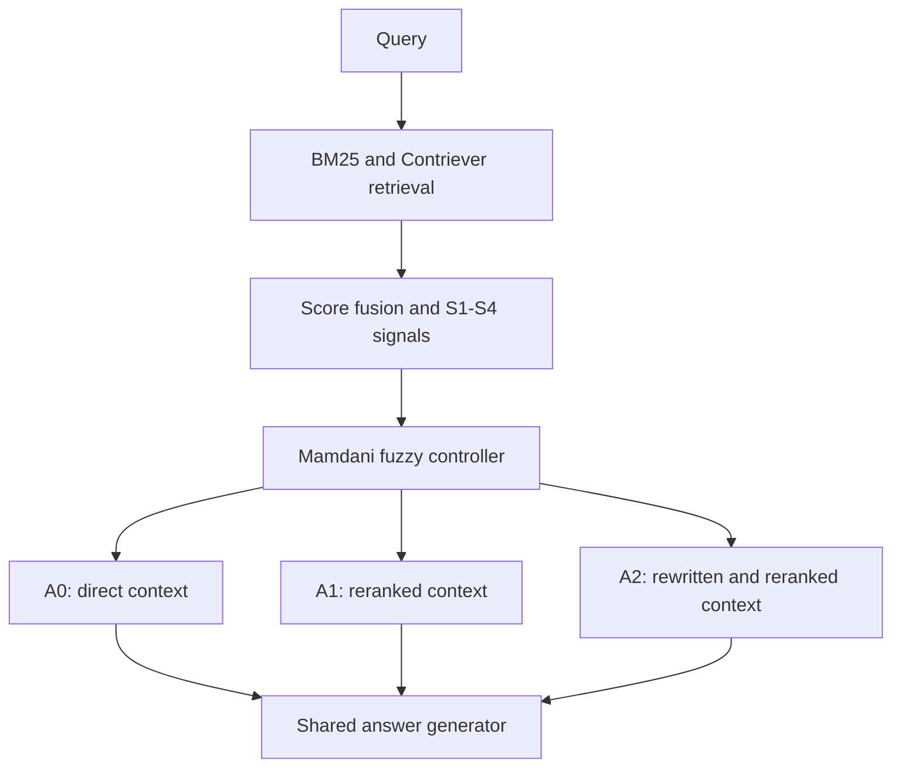

# FuzzyRoute-RAG

Uncertainty-aware adaptive routing for retrieval-augmented generation using an interpretable fuzzy controller.

> **Project status:** Active research prototype. The retrieval, uncertainty-signal, fuzzy-controller, and threshold-selection components are implemented. The complete A0/A1/A2 generation and evaluation pipeline is still under development. No final paper results are reported in this repository yet.

## Overview

Retrieval-augmented generation (RAG) systems often apply the same retrieval and generation procedure to every query. This can waste computation on easy queries while failing to allocate sufficient processing to difficult or unstable queries.

FuzzyRoute-RAG investigates whether four retrieval-side uncertainty signals can be combined by a transparent Type-1 Mamdani fuzzy inference system to select among retrieval actions with different computational costs. The intended objective is to improve the answer-quality–cost trade-off while reducing unnecessary routing changes across semantically equivalent query formulations.

The controller uses deterministic, human-readable rules instead of treating routing as an opaque decision.

## Research Question

Can an interpretable fuzzy controller use retrieval uncertainty to select the least costly action that maintains answer quality and remains stable across paraphrased queries?

## Method Overview



The current repository implements retrieval, fusion, S1–S4, fuzzy inference, and cost-constrained threshold selection. The three complete action pipelines and shared answer generator shown above are part of the planned experimental pipeline.

## Retrieval and Fusion

The initial candidate pool is produced by two complementary retrievers:

- **Sparse retrieval:** BM25 over the DPR Wikipedia passage corpus through Lucene/Pyserini.
- **Dense retrieval:** `facebook/contriever-msmarco`, using mean-pooled, unnormalized embeddings and inner-product scoring.

Each retriever returns its top 50 passages. Scores are normalized independently within each query and combined using equal-weight score fusion. Documents missing from one retrieval list receive zero from that retriever.

## Routing Signals

All raw signals are oriented so that a larger value indicates greater uncertainty and a stronger need to escalate.

### S1: Margin uncertainty

Let \(s_1 \geq s_2 \geq \cdots \geq s_k\) denote fused retrieval scores:

$$
S_1 = 1 - \frac{s_1-s_2}{s_1-s_k+\epsilon}.
$$

### S2: Rank disagreement

Rank disagreement is derived from extrapolated Rank-Biased Overlap between the BM25 and dense top-\(k\) rankings:

$$
\operatorname{RBO}_{\mathrm{EXT}}@k
=
(1-p)\sum_{d=1}^{k}p^{d-1}A_d+p^kA_k,
$$

$$
S_2 = 1-\operatorname{RBO}_{\mathrm{EXT}}@k,
$$

where \(A_d\) is the overlap proportion at depth \(d\). The current default is \(p=0.9\) and \(k=10\).

### S3: Evidence dispersion

For the embeddings of the top-\(k\) fused passages:

$$
S_3 = 1-\frac{2}{k(k-1)}\sum_{i<j}\cos(\mathbf{e}_i,\mathbf{e}_j).
$$

### S4: Score entropy

The top-\(k\) fused scores are converted to a probability distribution using a temperature-scaled softmax. The normalized entropy is:

$$
S_4 = -\frac{\sum_{i=1}^{k}p_i\log p_i}{\log k}.
$$

The current temperature is \(\tau=0.1\).

Before fuzzy inference, each signal is rescaled using the 5th and 95th percentiles fitted on training clusters only. Validation and test clusters must not be used to fit these scalers.

## Fuzzy Controller

The controller is a Type-1 Mamdani fuzzy inference system with:

- Four inputs: S1, S2, S3, and S4.
- Three linguistic labels per input: Low, Medium, and High.
- A complete \(3^4=81\)-rule base.
- Minimum for fuzzy AND.
- Maximum for rule aggregation.
- Centroid defuzzification.
- A continuous escalation score followed by two validation-selected thresholds.

Rules are generated from the ordinal levels Low = 0, Medium = 1, and High = 2. If the four-level sum is \(t\), the consequent is:

- Low escalation when \(t\leq3\).
- Medium escalation when \(t=4\).
- High escalation when \(t\geq5\).

This produces 31 Low, 19 Medium, and 31 High consequent rules.

The default membership-function width is 0.20. Per-signal calibrated widths are supported, with a maximum allowed width of 0.25.

## Routing Actions

| Action | Intended operation | Current status |
|---|---|---|
| A0 | Use the fused top-5 passages directly | Pipeline pending |
| A1 | Rerank the fused top-20 and retain the top 5 | Pipeline pending |
| A2 | Rewrite the query, perform a second hybrid retrieval, merge and deduplicate candidates, rerank the top 30, and retain the top 5 | Pipeline pending |

All actions are intended to use the same final top-5 context size, answer generator, prompt, and decoding configuration. This isolates the effect of routing and retrieval processing.

## Current Implementation Status

- [x] DPR passage reader
- [x] DPR-style answer matching and Recall@k
- [x] BM25 retrieval wrapper
- [x] Contriever query encoding
- [x] Exact sharded dense retrieval
- [x] Equal-weight hybrid fusion
- [x] S1–S4 computation
- [x] Training-only percentile scaler primitives
- [x] 81-rule Mamdani fuzzy controller
- [x] Validation-time threshold search under a cost budget
- [x] Fixed-action policy evaluation primitives
- [x] Unit tests for implemented components
- [ ] Config-driven data and experiment pipeline
- [ ] Cluster-level train/validation/test split
- [ ] Paraphrase generation and cluster validation
- [ ] Jitter-width calibration pipeline
- [ ] A0, A1, and A2 end-to-end actions
- [ ] Shared answer-generation pipeline
- [ ] EM, token-level F1, robustness, and cost evaluation
- [ ] Crisp, hard-threshold, fixed-width, and calibrated-fuzzy baselines
- [ ] Confidence intervals and final paper tables

## Repository Structure

```text
Fuzzy-RAG/
├── main_logic/
│   ├── answers.py       # DPR-style answer matching and Recall@k
│   ├── bm25.py          # BM25 retrieval wrapper
│   ├── corpus.py        # DPR passage reader
│   ├── dense.py         # Contriever encoder and dense retrieval
│   ├── fuzzy.py         # Mamdani fuzzy controller and rule base
│   ├── routing.py       # Action assignment and threshold selection
│   └── signals.py       # Fusion, S1-S4, and signal scaling
├── scripts/
│   ├── bm25_search.py
│   ├── smoke_retrieval.py
│   └── verify_embeddings.py
├── tests/
└── .gitignore
```

## Installation

The project currently uses separate environments for the main dense-retrieval pipeline and Pyserini BM25 retrieval. Pinned environment files will be added as the experiment pipeline is finalized.

### Core and dense-retrieval environment

```bash
python -m venv .venv
source .venv/bin/activate
python -m pip install --upgrade pip
python -m pip install numpy regex pytest torch transformers
```

On Windows PowerShell, activate the environment with:

```powershell
.venv\Scripts\Activate.ps1
```

### BM25 environment

Pyserini requires a compatible Java installation. Create a separate environment and install Pyserini according to the requirements of the selected release:

```bash
python -m venv .venv-bm25
source .venv-bm25/bin/activate
python -m pip install --upgrade pip
python -m pip install pyserini
```

Before running an experiment, record the Python, Java, Pyserini, PyTorch, Transformers, NumPy, and CUDA versions.

## External Data and Indexes

Large datasets and indexes are not included in the repository. The current implementation expects compatible copies of:

- DPR Wikipedia passages (`psgs_w100.tsv` or `psgs_w100.tsv.gz`)
- A Lucene BM25 index built over the same DPR passage IDs
- Precomputed `facebook/contriever-msmarco` passage embeddings
- A question file in JSON Lines format

The dense embeddings and sparse index must use the same passage-ID space. The loader verifies consecutive dense passage IDs, and the smoke test checks retrieval behavior and answer recall.

### Temporary path configuration

The current scripts still contain local path constants that must be updated before execution:

- `scripts/bm25_search.py`: `INDEX`
- `scripts/smoke_retrieval.py`: `DATA`
- `scripts/verify_embeddings.py`: `DATA`

These constants will be replaced by YAML configuration and command-line arguments in a subsequent revision.

## Running the Tests

From the repository root:

```bash
python -m pytest -q
```

The tests cover retrieval primitives, ranking signals, the complete fuzzy rule base, membership functions, deterministic action assignment, threshold selection, and cost-aware policy evaluation. Tests that require large external indexes are handled through separate smoke scripts rather than the unit-test suite.

## Running Retrieval Checks

### 1. BM25 retrieval

The input is a JSON Lines file containing one `{"question": "..."}` object per line.

```bash
python -m scripts.bm25_search \
  path/to/questions.jsonl \
  results/smoke/bm25.jsonl \
  --n 100 \
  --k 50
```

### 2. End-to-end retrieval smoke test

The question file used by the smoke test must provide `question` and `answer` fields. The `answer` field is a list of accepted gold-answer strings.

```bash
python -m scripts.smoke_retrieval \
  results/smoke/bm25.jsonl \
  path/to/NQ-open.dev.jsonl \
  results/smoke
```

The script produces:

- `retrieval.jsonl`: BM25, dense, fused rankings, and S1–S4 for each query.
- `report.json`: Recall@k, signal summaries, correlations, and runtime measurements.

The smoke test is a technical check and must not be reported as the final experiment.

### 3. Verify precomputed embeddings

```bash
python -m scripts.verify_embeddings --n 1000 --seed 0
```

This compares a deterministic sample of locally encoded passages with the precomputed Contriever embeddings.

## Reproducibility Notes

- The Contriever checkpoint is pinned to a specific Hugging Face revision in `main_logic/dense.py`.
- Retrieval ties are resolved deterministically.
- Passage IDs are checked for consistency across embedding shards.
- Signal scalers must be fitted on training clusters only.
- Routing thresholds must be selected on the validation split only.
- All paraphrases of one original question must remain in the same data split.
- Final runs should record the configuration file, random seed, Git commit, hardware, model revisions, prompts, and runtime environment.

## Known Limitations

- Exact dense retrieval over approximately 21 million passages is computationally expensive and is currently provisional.
- The complete A0/A1/A2 execution pipeline is not yet implemented.
- Width calibration, paraphrase robustness evaluation, and generation metrics are not yet integrated.
- Current experiment scripts still contain machine-specific paths.
- No state-of-the-art or cross-domain performance claim is made at this stage.

## Planned Evaluation

The final evaluation is intended to report:

- Exact Match and token-level F1
- Recall@5
- Action distribution
- Answer-quality–cost trade-off
- End-to-end latency and component latency
- Model calls and token usage
- Paraphrase-level routing stability
- Within-cluster answer variation
- Action-level and continuous monotonicity diagnostics

Fixed A0, A1, and A2 policies will be compared with hard-threshold, crisp ordinal, fixed-width fuzzy, and calibrated fuzzy routing baselines.

## Contributing

This repository is currently under active research development. Bug reports and reproducibility issues can be submitted through GitHub Issues. Please avoid treating intermediate smoke-test outputs as final research findings.

## Citation

A formal citation will be added after the accompanying paper is publicly available. Until then, please cite the repository URL and the exact Git commit used in an experiment.

## License

No software license has been selected yet. Please contact the repository owner before redistributing or reusing the code.
